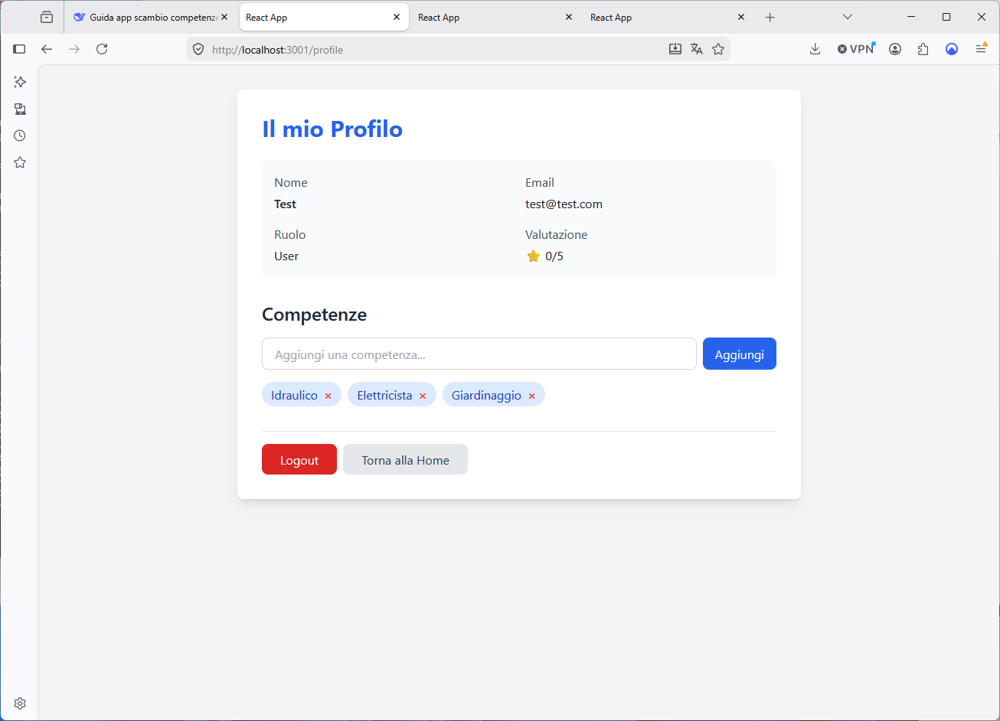
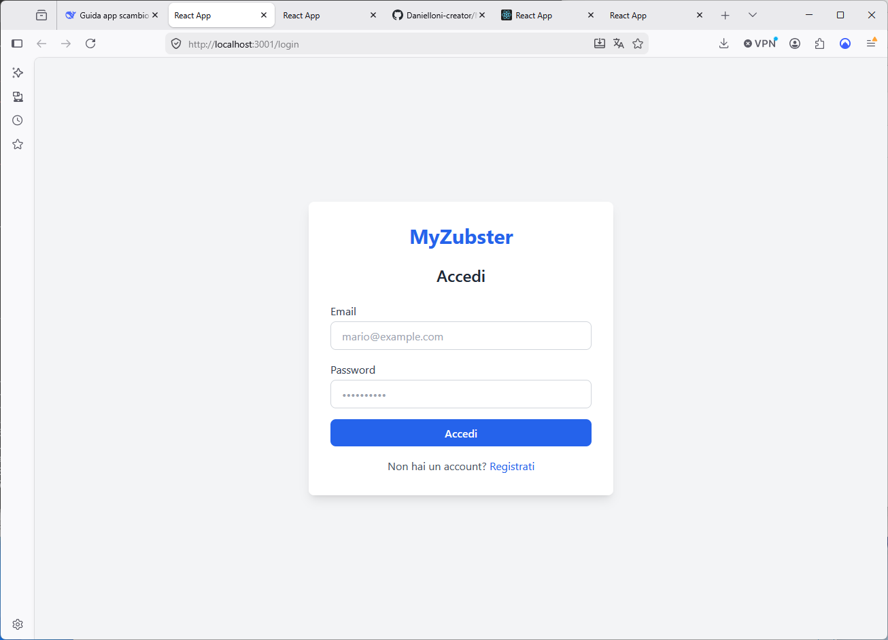

# MyZubster - Skill Exchange Platform with Monero


**MyZubster** is a full-stack community service platform that connects neighbors for skill exchange (plumber, hairdresser, IT technician, etc.) using **Monero (XMR)** as the exchange currency, ensuring privacy and security in every transaction.

## 🚀 Key Features

### Core Features
- 👤 **User Profiles** — Showcase skills you offer and list what you need
- 💬 **Messaging** — Communicate safely before confirming transactions
- 📍 **Location-Based Search** — Find services close to you
- ⭐ **Reputation System** — Two-way reviews build trust in the community
- 🛡️ **Community Guidelines** — Safe and respectful environment

### Advanced Features
- 📅 **Booking System** — Schedule appointments with calendar and time slots
- 📝 **Quotes & Estimates** — Professionals send quotes, clients accept/reject
- 📋 **Complete Work History** — Track all completed jobs with details
- 🔔 **Notifications** — Push for messages, quotes, and booking updates
- 🛠️ **Admin Panel** — Moderation tools for reports, users, skills, activity logs
- ✅ **Automated Testing** — Unit tests, API tests, and CI/CD with GitHub Actions
- 🌍 **Internationalization** — Full English UI with additional language support
- 🔄 **Dual Licensing** — MIT and GPLv3 licenses
- 🪙 **Decentralized Fee System** — Smart contract-based fee management with governance

### QR Code System
- 📱 **Generate QR Codes** — For profiles, payments, and bookings
- 📋 **Copy Address** — One-click copy to clipboard
- 📤 **Share QR** — Share via any app

### Offline Mode
- 💾 **Local Cache** — Data stored in memory and disk
- 🗄️ **Room Database** — Persistent local storage with SQLite
- 🔄 **Background Sync** — Automatic synchronization with WorkManager
- ⚡ **Conflict Resolution** — Smart handling of data conflicts
- 📶 **Offline Status UI** — Clear indication when offline

### Error Handling
- 🛡️ **Type-Safe Errors** — Sealed class hierarchy for all error types
- 🌐 **Network Error Mapping** — HTTP status codes to user-friendly messages
- 📱 **User-Friendly Messages** — Clear, localized error messages

## 🛠️ Tech Stack

| Layer | Technology |
|-------|------------|
| **Mobile** | Kotlin, Android SDK, Retrofit, Material Design |
| **Backend** | Node.js, Express, MongoDB, JWT, bcrypt |
| **Blockchain** | Solidity, Hardhat, Web3.js, OpenZeppelin |
| **Payments** | Monero RPC, Escrow, 2% Fee Service |
| **Local Storage** | Room Database (SQLite), SharedPreferences |
| **Background Sync** | WorkManager |
| **QR Code** | ZXing |
| **Testing** | JUnit (Android), Jest (Backend), Hardhat (Contracts) |
| **CI/CD** | GitHub Actions |

## 📸 Screenshots

### Profile Page with Skills


### Registration Page


### Login Page


### Home Dashboard


## 🚀 Quick Start

### Prerequisites
- Node.js 16+
- MongoDB (or use the in-memory mock)
- Monero wallet RPC (for testing payments)

### Clone & Install
```bash
# Clone the repository
git clone https://github.com/DanielIoni-creator/MyZubsterAPP.git
cd MyZubsterAPP

# Backend setup
cd backend
npm install
cp .env.example .env
# Edit .env with your credentials
npm start

# Android App
# Open project in Android Studio
# Sync Gradle and build APK
# Install on device or emulator

# Optional: Web Dashboard
cd web-dashboard
npm install
npm start

# Optional: Admin Panel
cd admin-panel
npm install
npm start

Docker Setup (Recommended)
bash

# Start the entire stack with Docker
docker-compose up -d

Environment Variables

Create a .env file in the backend folder:
env

PORT=3000
MONGODB_URI=mongodb://localhost:27017/myzubster
JWT_SECRET=your_super_secret_key
MONERO_RPC_URL=http://localhost:18083

🧪 Testing
bash

# Backend tests
cd backend
npm test

# Smart contract tests
cd backend
npx hardhat test

# Android tests
./gradlew test

# All tests with GitHub Actions (automated on every commit)

📱 Installation

    Download APK from Releases

    Enable "Install from unknown sources" in Android settings

    Open the APK file and tap "Install"

    Launch the app and create your account

🤝 How to Contribute

We welcome contributors of all experience levels!

    Fork the repository

    Create a feature branch (git checkout -b feature/amazing-feature)

    Make your changes and test them

    Submit a Pull Request with a clear description

See CONTRIBUTING.md for detailed guidelines.
💰 Contributor Rewards

Earn 10% of the platform fee generated by your contributions!

    ✅ Pull requests merged

    ✅ Bug fixes

    ✅ Feature implementations

    ✅ Security improvements

How it works:

    Your PR is merged

    Your contribution is tracked

    You earn 10% of the 2% fee (0.2% of transaction value)

    Paid monthly in XMR to your wallet

🛡️ Security & Privacy

    🔒 Environment Variables — Never commit .env files

    🔐 HTTPS — All communication encrypted

    📱 FCM — Push notifications support

    🛡️ Role-Based Access — Admin/Moderator control

    🔑 Non-Custodial Payments — Private keys never leave user's device

    🔗 Monero Multisig — Secure fund locking in escrow

    ✅ Audited Smart Contracts — Open source and audited

If you find a security issue, please contact the maintainer privately.
📄 License

This project is dual-licensed under:

    MIT License — Maximum flexibility

    GNU General Public License v3.0 — Copyleft protection

SPDX-License-Identifier: MIT OR GPL-3.0-or-later
🙏 Acknowledgments

    Monero for privacy-first digital cash

    All open-source libraries and contributors

    The community for feedback and support

    Ethereum and Hardhat communities for smart contract tooling

📊 Project Status
Metric	Value
Stars	1
Releases	5
Contributors	1
Languages	Kotlin, Java, JavaScript, HTML, CSS
📬 Get Involved

    GitHub: DanielIoni-creator/MyZubsterAPP

    Issues: Report bugs and request features

    Discussions: Join the community conversation

Made with ❤️ by the MyZubster community